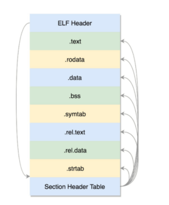

# 操作系统

## 1. 综述

### 1.1 系统组成


### 1.2 命令行

#### 文件目录

```SHELL
# ls -l
drwxr-xr-x 6 root root    4096 Oct 20  2017 apt
-rw-r--r-- 1 root root     211 Oct 20  2017 hosts
```

第一个字段的第一个字符是文件类型。如果是“-”，表示普通文件；如果是 d，就表示目录。第一个字段剩下的 9 个字符是权限位（access permission bits）。3 个一组，**每一组 rwx 表示“读（read）”“写（write）”“执行（execute）”**。

第二个字段是硬链接（hard link）数目

#### 服务运行

Ubuntu 中，通过 apt-get install mysql-server 的方式安装 MySQL，**在 /lib/systemd/system 目录下会创建一个 [*].service 的配置文件**

CentOS 中，在 **/usr/lib/systemd/system** 目录下，创建一个 [*].service 的配置文件

+ 通过命令systemctl start mysql启动 MySQL
+ 通过systemctl enable mysql设置开机启动。


### 1.3 系统调用

#### 进程管理

创建一个新的进程，需要一个老的进程调用 fork 来实现，老的进程叫作父进程（Parent Process），新的进程叫作子进程（Child Process）。对于 fork 系统调用的返回值

+ 如果当前进程是子进程，就返回 0
+ 如果当前进程是父进程，就返回子进程的进程号

子进程，需要请求另一个系统调用**execve**来执行另一个程序

系统调用waitpid，父进程可以调用它，将子进程的进程号作为参数传给它，这样父进程就知道子进程是否运行完成和成功。


#### 内存管理

代码段是放程序代码的这部分。数据段是放进程运行中产生数据的。

当分配的内存数量比较小的时候，**使用 brk，会和原来的堆的数据连在一起。**

当分配的内存数量比较大的时候，**使用 mmap，会重新划分一块区域。**


#### 文件管理

文件的操作

+ 打开文件使用open，close关闭这个文件
+ 创建没有的文件可以使用create
+ 打开文件以后，可以使用lseek跳到文件的某个位置
+ 对文件的内容进行读写，读的系统调用是read，写是write

**Linux 里有一个特点，那就是一切皆文件**

+ 启动一个进程，需要一个程序文件，这是一个**二进制文件**
+ 加载一些配置文件，打印一些日志，这是**文本文件**
+ 日志打印到交互控制台上，是**标准输出 stdout 文件**
+ 这个进程的输出可以作为另一个进程的输入，这种方式称为管道，**管道**也是一个文件。
+ 进程可以通过网络和其他进程进行通信，**建立的 Socket，也是一个文件。**
+ 进程需要访问外部设备，**设备也是一个文件。**
+ 文件都被存储在文件夹里面，其实**文件夹也是一个文件。**
+ 进程运行起来，要想看到进程运行的情况，**会在 /proc 下面有对应的进程号，还是一系列文件。**

**Linux 都会分配一个文件描述符（File Descriptor）**，这是一个整数。有了这个文件描述符，我们就可以使用系统调用，查看或者干预进程运行的方方面面。


#### 信号处理

SIGKILL：用于终止一个进程的信号

SIGSTOP：用于中止一个进程的信号


#### 中介Glibc

Glibc 为程序员提供丰富的 API，最重要的是**封装了操作系统提供的系统服务，即系统调用的封装。**


## 2. 系统初始化

### 2.1 x86架构

核心是CPU，**CPU和其他设备通过总线连接**


#### CPU 架构


CPU包括三个部分，运算单元、数据单元和控制单元。

+ 运算单元只管算，例如做加法、做位移等等。
+ 数据单元根据数据的地址，从数据段里读到数据寄存器里。
+ 控制单元获得下一条指令，然后执行这条指令。这个指令会指导**运算单元取出数据单元中的某几个数据，计算出个结果，然后放在数据单元的某个地方。**
  + **指令指针寄存器**存放的是下一条指令在内存中的地址
  + **指令寄存器**拿进来的代码段的指令

总线分为两类

+ 地址总线：内存中哪个位置的数据
+ 数据总线：传输数据

x86实现了开放、统一、兼容规范


#### 8086 CPU

数据单元：8 个 16 位的通用寄存器。e.g. AX、BX、CX、DX、SP、BP、SI、DI

控制单元

+ IP 寄存器： 指令指针寄存器
+ CS 代码段寄存器（Code Segment Register）可以找到代码在内存中的位置
+ DS 数据段的寄存器（Data Segment Register），可以找到数据在内存中的位置
+ SS 栈寄存器（Stack Register）, 函数调用

IP寄存器和通用寄存器都是 16 位的。CS 和 DS 都是 16 位的，但是总线是20位，所以CS 和 DS 中的值**左移 4 位，**变成 20 位的，**加上 16 位的偏移量得到最终 20 位的数据地址**


#### 32位 CPU

通用寄存器: 扩展到 8 个 32 位的

CS/DS/SS/ES: 段的起始地址放在内存的某个地方。如同表格，表格中的一项一项是段描述符（Segment Descriptor）。**段描述符才是真正的段的起始地址。**段寄存器里面保存的是选择子（Selector），是指向这个表格中的某一项。

+ 实模式：段寄存器指向内存地址

+ 保护模式：段寄存器指向表格中的段描述符

CPU在启动时逐渐从实模式切换到保护模式。


### 2.2 内核加载


#### BIOS

ROM（Read Only Memory，只读存储器）保存BIOS（Basic Input and Output System，基本输入输出系统）。x86 系统中，将 1M 空间最上面的 0xF0000 到 0xFFFFF 这 64K 映射给 ROM， BIOS开始初始化工作。

+ 检查系统的硬件
+ 建立一个中断向量表和中断服务程序，e.g. 鼠标和键盘操作都是通过中断


#### bootloader

Linux 里面有Grub2，全称 Grand Unified Bootloader Version 2，用于系统启动的。

+ boot.img 从硬盘加载到内存中的 0x7c00 来运行
+ grub2安装boot.img，由 boot.S 编译而成，一共 512 字节，正式安装到启动盘的第一个扇区。通常称为 MBR（Master Boot Record，主引导记录 / 扇区）。
+ boot.img 先加载的是 core.img 的第一个扇区， boot.img 将控制权交给 diskboot.img
+ diskboot.img将 core.img 的其他部分加载进来


#### 保护模式

+ 打开 Gate A20，第 21 根地址线的控制线。
+ **启用分段**，就是在内存里面建立段描述符表，将寄存器里面的段寄存器变成段选择子，指向某个段描述符，这样就能实现不同进程的切换了
+ **启动分页**，能够管理的内存变大了，就需要将内存分成相等大小的块
+ 解压lzma_decompress.img
+ 解压kernel.img，运行grub2 keneral
+ **Grub2 启动 linux内核**


### 2.3 内核初始化


#### 初始化管理子系统

+ 创建的0 号进程
+ 初始化系统调用模块，包括中断们用于输入输出
+ 初始化内存管理模块
+ 初始化基于内存的文件系统，文件系统为了兼容各种各样的文件系统，需要将文件的相关数据结构和操作抽象出来，形成一个抽象层对上提供统一的接口，这个抽象层就是 VFS（Virtual File System），虚拟文件系统。


#### 初始化1号/2号进程

rest_init 的第一工作是用 kernel_thread(kernel_init, NULL, CLONE_FS) 创建1号进程管理用户进程

rest_init 的第一工作是用 kernel_thread(kernel_init, NULL, CLONE_FS) 创建2号进程管理内核进程


#### 内核态/用户态切换


内核态（Kernel Mode）：能够访问关键资源的代码放在 Ring0

用户态（User Mode）: 普通的程序代码放在 Ring3


### 2.4 系统调用

#### 32位系统调用

+ 将请求参数放在寄存器里面
+ 根据系统调用名称，得到系统调用号，放在寄存器 eax 里面
+ 执行 ENTER_KERNEL
+ 从 eax 里面取出来系统调用号，然后根据系统调用号，在系统调用表sys_call_table中找到相应的函数进行调用，并将寄存器中保存的参数取出来，作为函数参数
+ iret 指令将原来用户态保存的现场恢复回来


#### 64位系统调用

+ 将请求参数放在寄存器里面
+ 根据系统调用名称，得到系统调用号，放在寄存器 eax 里面
+ 执行 syscall 进入内核， syscall是特殊模块寄存器，为CPU执行系统调用
+ 从rax 里面拿出系统调用号，然后根据系统调用号，在系统调用表 sys_call_table 中找到相应的函数进行调用，并将寄存器中保存的参数取出来，作为函数参数
+ sysretq 指令将原来用户态保存的现场恢复回来


#### 系统调用表

32 位的系统调用表定义在 arch/x86/entry/syscalls/syscall_32.tbl 文件里

64 位的系统调用定义在另一个文件 arch/x86/entry/syscalls/syscall_64.tbl 里

+ 第一列的数字是系统调用号
+ 第三列是系统调用的名字
+ 第四列是系统调用在内核的实现函数。

```assembly
2  common  open      sys_open
```


## 3. 进程管理

### 3.1 进程

#### 进程代码

process.c

```c
#include <stdio.h>
#include <stdlib.h>
#include <sys/types.h>
#include <unistd.h>
extern int create_process (char* program, char** arg_list);

int create_process (char* program, char** arg_list) {
    pid_t child_pid;
    child_pid = fork ();
    if (child_pid != 0)
        return child_pid;
    else {
        execvp (program, arg_list);
        abort ();
    }
}
```

createprocess.c

```c
#include <stdio.h>
#include <stdlib.h>
#include <sys/types.h>
#include <unistd.h>
extern int create_process (char* program, char** arg_list);

int main () {
    char* arg_list[] = {
        "ls",
        "-l",
        "/etc/yum.repos.d/",
        NULL
    };
    create_process ("ls", arg_list);
    return 0;
}
```


#### ELF 程序的二进制格式

源代码被编译成二进制文件，这个格式称为 ELF（Executeable and Linkable Format，可执行与可链接格式）。


##### 可重定位文件



ELF 文件的头是用于描述整个文件的

+ .text：放编译好的二进制可执行代码
+ .data：已经初始化好的全局变量
+ .rodata：只读数据，例如字符串常量、const 的变量
+ .bss：未初始化全局变量，运行时会置 0
+ .symtab：符号表，记录的则是函数和变量
+ .strtab：字符串表、字符串常量和变量名

编译好的代码和变量，将来加载到内存里面的时候，都是要加载到一定位置的。**.o 文件，不是一个可以直接运行的程序**，这里面只是部分代码片段。**create_process 函数不确定位置，需要可以重新定位代码片段。**.rel.text, .rel.data 就与重定位有关。


##### 可执行文件 - 静态链接


把process.o创建成静态链接库。**静态链接库一旦链接进去，代码和变量的 section 都合并了**，因而程序运行的时候，就不依赖于这个库是否存在

```shell
ar cr libstaticprocess.a process.o
gcc -o staticcreateprocess createprocess.o -L. -libstaticprocess
```

##### 共享对象文件 - 动态链接

动态链接库（Shared Libraries）是多个对象文件的重新组合，可被多个程序共享。当运行这个程序的时候，首先寻找动态链接库，然后加载它。默认情况下，系统在 **/lib， /usr/lib 和 LD_LIBRARY_PATH 环境变量**

```SHELL
gcc -shared -fPIC -o libdynamicprocess.so process.o
gcc -o dynamiccreateprocess createprocess.o -L. -ldynamicprocess
```

+ 多了一个.interp 的 Segment，这里面是 **ld-linux.so，这是动态链接器**，运行时的链接动作都是它做的
+ ELF 文件中还多了两个 section
  + 一个是.plt，过程链接表（Procedure Linkage Table，PLT）
  + 一个是.got.plt，全局偏移量表（Global Offset Table，GOT）

**调用过程**

+ PLT 里面建立一项 PLT[x]。本地的代理，在二进制程序里面，不直接调用 create_process 函数，而是调用 PLT[x]里面的代理代码，这个代理代码会在运行的时候找真正的 create_process 函数
+ GOT[y]一项是运行时 create_process 函数在内存中真正的地址
+ GOT[y]没有真正的地址，它又回调 PLT
+ PLT 这个时候会转而调用 PLT[0]，PLT[0]转而调用 GOT[2]，这里面是 ld-linux.so 的入口函数


#### 内核数据结构

在内核中，linux_binfmt数据结构定义加载二进制文件的方法

```c
struct linux_binfmt {
        struct list_head lh;
        struct module *module;
        int (*load_binary)(struct linux_binprm *);
        int (*load_shlib)(struct file *);
        int (*core_dump)(struct coredump_params *cprm);
        unsigned long min_coredump;     /* minimal dump size */
} __randomize_layout;
```

```c
static struct linux_binfmt elf_format = {
        .module         = THIS_MODULE,
        .load_binary    = load_elf_binary,
        .load_shlib     = load_elf_library,
        .core_dump      = elf_core_dump,
        .min_coredump   = ELF_EXEC_PAGESIZE,
};
```


#### 进程树


#### 总结


### 3.2 线程

#### 创建线程

```c

#include <pthread.h>
#include <stdio.h>
#include <stdlib.h>

#define NUM_OF_TASKS 5

void *downloadfile(void *filename)
{
   printf("I am downloading the file %s!\n", (char *)filename);
   sleep(10);
   long downloadtime = rand()%100;
   printf("I finish downloading the file within %d minutes!\n", downloadtime);
   pthread_exit((void *)downloadtime);
}

int main(int argc, char *argv[])
{
   char files[NUM_OF_TASKS][20]={"file1.avi","file2.rmvb","file3.mp4","file4.wmv","file5.flv"};
   pthread_t threads[NUM_OF_TASKS];
   int rc;
   int t;
   int downloadtime;
	 
   // 声明线程属性 
   pthread_attr_t thread_attr;
   // 初始化线程属性
   pthread_attr_init(&thread_attr);
   pthread_attr_setdetachstate(&thread_attr,PTHREAD_CREATE_JOINABLE);

   for(t=0;t<NUM_OF_TASKS;t++){
     printf("creating thread %d, please help me to download %s\n", t, files[t]);
     
     // 创建线程
     // 第一个参数：线程对象
     // 第二个参数：线程属性
     // 第三个参数：线程执行的方法
     // 第四个参数：线程执行的方法的参数
     rc = pthread_create(&threads[t], &thread_attr, downloadfile, (void *)files[t]);
     if (rc){
       printf("ERROR; return code from pthread_create() is %d\n", rc);
       exit(-1);
     }
   }

   pthread_attr_destroy(&thread_attr);

   for(t=0;t<NUM_OF_TASKS;t++){
     pthread_join(threads[t],(void**)&downloadtime);
     printf("Thread %d downloads the file %s in %d minutes.\n",t,files[t],downloadtime);
   }

   pthread_exit(NULL);
}
```


#### 线程数据

+ 线程栈上的本地数据
+ 整个进程里共享的全局数据
+ 线程私有数据（Thread Specific Data）: key 一旦被创建，所有线程都可以访问它，**但各线程可根据自己的需要往 key 中填入不同的值**，这就相当于提供了一个同名而不同值的全局变量。

```C

int pthread_key_create(pthread_key_t *key, void (*destructor)(void*))
int pthread_setspecific(pthread_key_t key, const void *value)
void *pthread_getspecific(pthread_key_t key)
```

#### 数据保护

操作共享资源的时候，还是需要抢互斥锁，因为可能很多人都受到了通知，都来访问了，所以条件变量和互斥锁是配合使用的。

+ Mutex，首先要使用 pthread_mutex_init 函数初始化这个 mutex
+ pthread_mutex_lock() 是去抢那把锁的函数，
  + 如果抢到了就可以执行下一行程序，对共享变量进行访问
  + 如果没抢到，就被阻塞在那里等待。
+ pthread_mutex_unlock 释放锁
+ 最终调用 pthread_mutex_destroy 销毁掉这把锁。


```C

#include <pthread.h>
#include <stdio.h>
#include <stdlib.h>

#define NUM_OF_TASKS 3
#define MAX_TASK_QUEUE 11

char tasklist[MAX_TASK_QUEUE]="ABCDEFGHIJ";
int head = 0;
int tail = 0;

int quit = 0;

pthread_mutex_t g_task_lock;
pthread_cond_t g_task_cv;

// 消费者代码
void *coder(void *notused)
{
  pthread_t tid = pthread_self();

  while(!quit){
		// 获取mutex lock
    pthread_mutex_lock(&g_task_lock);
    while(tail == head){
      if(quit){
        pthread_mutex_unlock(&g_task_lock);
        pthread_exit((void *)0);
      }
      printf("No task now! Thread %u is waiting!\n", (unsigned int)tid);
      // 持续检查任务队列是否为空，如果为空就继续等待，等待的时候会释放锁
      pthread_cond_wait(&g_task_cv, &g_task_lock);
      printf("Have task now! Thread %u is grabing the task !\n", (unsigned int)tid);
    }
    
    // 执行一下代码如果任务队列不为空，操作共享变量
    char task = tasklist[head++];
    // 释放锁
    pthread_mutex_unlock(&g_task_lock);
    printf("Thread %u has a task %c now!\n", (unsigned int)tid, task);
    sleep(5);
    printf("Thread %u finish the task %c!\n", (unsigned int)tid, task);
  }

  pthread_exit((void *)0);
}

int main(int argc, char *argv[])
{
  pthread_t threads[NUM_OF_TASKS];
  int rc;
  int t;

  pthread_mutex_init(&g_task_lock, NULL);
  pthread_cond_init(&g_task_cv, NULL);

  for(t=0;t<NUM_OF_TASKS;t++){
    rc = pthread_create(&threads[t], NULL, coder, NULL);
    if (rc){
      printf("ERROR; return code from pthread_create() is %d\n", rc);
      exit(-1);
    }
  }

  sleep(5);

  for(t=1;t<=4;t++){
    pthread_mutex_lock(&g_task_lock);
    tail+=t;
    printf("I am Boss, I assigned %d tasks, I notify all coders!\n", t);
    //唤醒所有线程
    pthread_cond_broadcast(&g_task_cv);
    pthread_mutex_unlock(&g_task_lock);
    sleep(20);
  }

  pthread_mutex_lock(&g_task_lock);
  quit = 1;
  pthread_cond_broadcast(&g_task_cv);
  pthread_mutex_unlock(&g_task_lock);

  pthread_mutex_destroy(&g_task_lock);
  pthread_cond_destroy(&g_task_cv);
  pthread_exit(NULL);
}
```


#### 总结


### 3.3 任务结构

Linux 里面，无论是进程，还是线程，到了内核里面，我们统一都叫任务（Task），由一个统一的结构 task_struct 进行管理。

**进程**，那 pid 是自己，tgid 是自己，group_leader 指向的还是自己

**线程**，那 pid 是自己，tgid 就是进程的主线程的 pid，group_leader 指向的就是进程的主线程。

#### 信号处理

```C
/* Signal handlers: */
struct signal_struct    *signal;
struct sighand_struct    *sighand;
sigset_t      blocked;
sigset_t      real_blocked;
sigset_t      saved_sigmask;
struct sigpending    pending;
unsigned long      sas_ss_sp;
size_t        sas_ss_size;
unsigned int      sas_ss_flags;
```

+ blocked: 信号被阻塞暂不处理
+ pending: 信号尚等待处理
+ sighand: 正在通过信号处理函数进行处理


#### 任务状态


+ **TASK_RUNNING**： 并不是说进程正在运行，而是表示进程在时刻准备运行的状态
+ **TASK_INTERRUPTIBLE**：可中断的睡眠状态，信号可以唤醒进程
+ **TASK_UNINTERRUPTIBLE**：不可中断的睡眠状态，线程不能被唤醒
+ **TASK_KILLABLE**：可以终止的新睡眠状态，可以响应致命信号
+ **TASK_STOPPED**：进程接收到 SIGSTOP、SIGTTIN、SIGTSTP 或者 SIGTTOU 信号之后进入该状态
+ **TASK_TRACED**：进程被 debugger 等进程监视，进程执行被调试程序所停止
+ **EXIT_ZOMBIE**：进程要结束
+ **EXIT_DEAD**：最终状态


#### 其他状态标志

```C
#define PF_EXITING    0x00000004
#define PF_VCPU      0x00000010
#define PF_FORKNOEXEC    0x00000040
```

+ PF_EXITING 表示正在退出
+ PF_VCPU 表示进程运行在虚拟 CPU 上
+ PF_FORKNOEXEC 表示 fork 完了，还没有 exec。


#### 运行统计信息

```C
u64        utime;//用户态消耗的CPU时间
u64        stime;//内核态消耗的CPU时间
unsigned long      nvcsw;//自愿(voluntary)上下文切换计数
unsigned long      nivcsw;//非自愿(involuntary)上下文切换计数
u64        start_time;//进程启动时间，不包含睡眠时间
u64        real_start_time;//进程启动时间，包含睡眠时间
```


#### 亲缘关系

```C
struct task_struct __rcu *real_parent; /* real parent process */
struct task_struct __rcu *parent; /* recipient of SIGCHLD, wait4() reports */
struct list_head children;      /* list of my children */
struct list_head sibling;       /* linkage in my parent's children list */
```

+ parent 指向其父进程。当它终止时，必须向它的父进程发送信号
+ children 表示链表的头部。链表中的所有元素都是它的子进程
+ sibling 用于把当前进程插入到兄弟链表中。


#### 权限控制

```C
/* Objective and real subjective task credentials (COW): */
const struct cred __rcu         *real_cred;
/* Effective (overridable) subjective task credentials (COW): */
const struct cred __rcu         *cred;
```

+ real_cred 就是说明谁能操作我这个进程
+ cred 就是说明我这个进程能够操作谁

```C

struct cred {
......
        kuid_t          uid;            /* real UID of the task */
        kgid_t          gid;            /* real GID of the task */
        kuid_t          suid;           /* saved UID of the task */
        kgid_t          sgid;           /* saved GID of the task */
        kuid_t          euid;           /* effective UID of the task */
        kgid_t          egid;           /* effective GID of the task */
        kuid_t          fsuid;          /* UID for VFS ops */
        kgid_t          fsgid;          /* GID for VFS ops */
......
        kernel_cap_t    cap_inheritable; /* caps our children can inherit */
        kernel_cap_t    cap_permitted;  /* caps we're permitted */
        kernel_cap_t    cap_effective;  /* caps we can actually use */
        kernel_cap_t    cap_bset;       /* capability bounding set */
        kernel_cap_t    cap_ambient;    /* Ambient capability set */
......
} __randomize_layout;
```


##### 用户和用户组权限

+ euid/egid，是 effective user/group id。当这个进程要操作消息队列、共享内存、信号量等对象的时候，其实就是在比较这个用户和组是否有权限。
+ fsuid/fsgid，是 filesystem user/group id。这个是对文件操作会审核的权限。


可以通过 chmod u+s program 命令，给这个游戏程序设置 set-user-ID 的标识位，把游戏的权限变成 rwsr-xr-x。这个时候，用户 A 再启动这个游戏的时候，创建的进程 uid 当然还是用户 A，但是 euid 和 fsuid 就不是用户 A 了，因为看到了 set-user-id 标识，**就改为文件的所有者的 ID，也就是说，euid 和 fsuid 都改成用户 B 了**。


##### capabilities

```C
#define CAP_CHOWN            0
#define CAP_KILL             5
#define CAP_NET_BIND_SERVICE 10
#define CAP_NET_RAW          13
#define CAP_SYS_MODULE       16
#define CAP_SYS_RAWIO        17
#define CAP_SYS_BOOT         22
#define CAP_SYS_TIME         25
#define CAP_AUDIT_READ          37
#define CAP_LAST_CAP         CAP_AUDIT_READ
```

+ **cap_permitted** 表示进程能够使用的权限。
+ **cap_effective** 表示进程真正可以使用的权限
+ **cap_bset** 是 capability bounding set，是系统中所有进程允许保留的权限。如果这个集合中不存在某个权限，那么系统中的所有进程都没有这个权限
+ **cap_ambient** 非 root 用户进程使用 exec 执行一个程序的时候，如何保留权限的问题。当执行 exec 的时候，cap_ambient 会被添加到 cap_permitted 中，同时设置到 cap_effective 中


#### 用户态函数栈

##### 32 位操作系统

+ ESP（Extended Stack Pointer）是栈顶指针寄存器，入栈操作 Push 和出栈操作 Pop 指令，会自动调整 ESP
+ EBP（Extended Base Pointer），是栈基地址指针寄存器
+ 参数压入栈顶
+ 返回值会保存在 EAX 寄存器中


##### 64 位操作系统

+ RSP 是栈顶指针寄存器，入栈操作 Push 和出栈操作 Pop 指令，会自动调整 ESP
+ RBP是栈基地址指针寄存器
+ rdi、rsi、rdx、rcx、r8、r9 这 6 个寄存器用于传递存储函数调用时的 6 个参数。如果超过 6 的时候，还是需要放到栈里面。


#### 内核态函数栈

这段空间的最低位置，是一个 thread_info 结构。这个结构是对 task_struct 结构的补充。因为 task_struct 结构庞大但是通用，不同的体系结构就需要保存不同的东西，所以往往与体系结构有关的，都放在 thread_info 里面。


```C
/*
 * TOP_OF_KERNEL_STACK_PADDING reserves 8 bytes on top of the ring0 stack.
 * This is necessary to guarantee that the entire "struct pt_regs"
 * is accessible even if the CPU haven't stored the SS/ESP registers
 * on the stack (interrupt gate does not save these registers
 * when switching to the same priv ring).
 * Therefore beware: accessing the ss/esp fields of the
 * "struct pt_regs" is possible, but they may contain the
 * completely wrong values.
 */
#define task_pt_regs(task) \
({                  \
  unsigned long __ptr = (unsigned long)task_stack_page(task);  \
  __ptr += THREAD_SIZE - TOP_OF_KERNEL_STACK_PADDING;    \
  ((struct pt_regs *)__ptr) - 1;          \
})
```

先从 task_struct 找到内核栈的开始位置。然后这个位置加上 THREAD_SIZE 就到了最后的位置，然后转换为 struct pt_regs，再减一，就相当于减少了一个 pt_regs 的位置，就到了这个结构的首地址

```C
#ifdef CONFIG_X86_32
# ifdef CONFIG_VM86
#  define TOP_OF_KERNEL_STACK_PADDING 16
# else
#  define TOP_OF_KERNEL_STACK_PADDING 8
# endif
#else
# define TOP_OF_KERNEL_STACK_PADDING 0
#endif
```


thread_info中有成员变量 task 指向 task_struct， 常用 current_thread_info()->task 来获取 task_struct。

```C
struct thread_info {
  struct task_struct  *task;    /* main task structure */
  __u32      flags;    /* low level flags */
  __u32      status;    /* thread synchronous flags */
  __u32      cpu;    /* current CPU */
  mm_segment_t    addr_limit;
  unsigned int    sig_on_uaccess_error:1;
  unsigned int    uaccess_err:1;  /* uaccess failed */
};

static inline struct thread_info *current_thread_info(void)
{
  return (struct thread_info *)(current_top_of_stack() - THREAD_SIZE);
}
```

