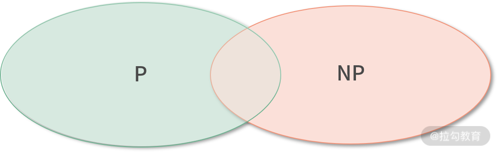
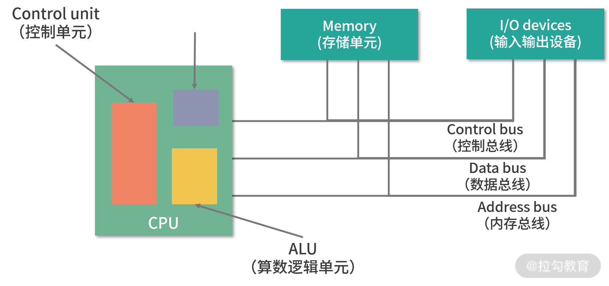
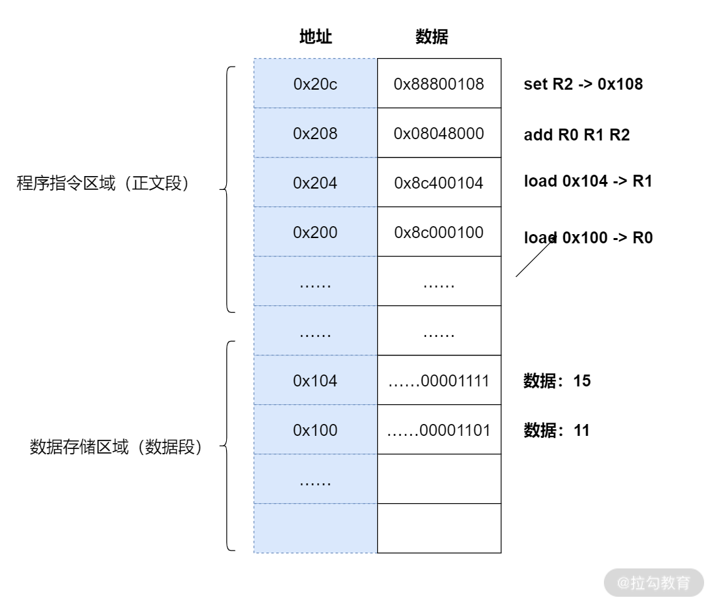

# 操作系统

## 1. 可计算理论

#### 计算机发展

+ 第一次工业革命出现了蒸汽机，能源是煤炭。
+ 第二次工业革命出现了发电机，能源是电。
+ 第三次科技革命，革命产物是计算机，能源是数字能量。
+ 第四次科技革命，就发生在当下，出现了人工智能，能源是数据。

先有计算机，后有的芯片。

+ 世界上第一个芯片，也被称作集成电路， 1958 年由美国德州仪器公司的工程师杰克·基尔比发明。
+ 世界上第一台通用计算机 ENIAC 则是在 1946 年诞生于美国陆军弹道研究实验室。

#### 可计算理论

哪些问题可以被计算，哪些不可以被计算，这就是可计算性理论，该理论是计算机科学的理论基础之一。1936 年，被誉为人工智能之父的阿兰·图灵提出了**图灵机**。

图灵机发现如果一个问题是可计算的，那么它的解决方案就必须可以被具化成一条条的指令，也就是可以使用图灵机处理。因此，不能使用图灵机处理的问题，都是不可计算的问题。

#### 不可计算问题

+ 素数是不是有无穷多个
+ 停机问题：用一个通用程序去判断另一个程序是否会停止，

#### 计算边界

可计算的问题中，有困难问题，也有简单问题，我们通常用复杂度来衡量， 比如可以用O(1), O(N^3), O(N^100)

今天能解决的问题，都是多项式时间的问题，下面记为 P 类型的问题。

NP问题复杂度随指数增长，当N无限大时，会因为计算能力不足无法解决

## 2. 计算机组成

### 图灵机

清楚地定义了计算机能力的边界，也就是可计算理论；

定义了计算机由哪些部分组成，程序又是如何执行的。

+ 拥有一条无限长的纸带，纸带上是一个格子挨着一个格子，格子中可以写字符，可以把纸带看作内存，而这些字符可以看作是内存中的数据或者程序。
+ 图灵机有一个读写头，读写头可以读取任意格子上的字符，也可以改写任意格子的字符。
+ 读写头上面的盒子里是一些精密的零件，**包括图灵机的存储、控制单元和运算单元**。

### 冯诺依曼模型

组成部分

+ 输入设备
+ 输出设备；
+ 内存；
+ 中央处理器；
+ 总线。

#### 内存

存储的数据单位是一个二进制位，英文是 bit。**最小的存储单位叫作字节，也就是 8 位，英文是 byte**，每一个字节都对应一个内存地址。内存地址由 0 开始编号，比如第 1 个地址是 0，第二个地址是 1， 然后自增排列，最后一个地址是内存中的字节数减 1。

**内存都是随机存取器，也就是读取任何一个地址数据的速度是一样的，写入任何一个地址数据的速度也是一样的。**

#### CPU

如果 CPU 每次可以计算 4 个 byte，那么我们称作 32 位 CPU；

如果 CPU 每次可以计算 8 个 byte，那么我们称作 64 位 CPU。

这里的 32 和 64，**称作 CPU 的位宽。**

#### 控制单元和逻辑运算单元

CPU 中有一个控制单元专门负责控制 CPU 工作；还有逻辑运算单元专门负责计算。具体的工作原理我们在指令部分给大家分析。

#### 寄存器

CPU内存单元。寄存器就在 CPU 里，控制单元和逻辑运算单元非常近，因此速度很快。

+ 一部分是可供用户编程用的，比如用**来存加和指令的两个参数，是通用寄存器。**
+ 一部分寄存器有特殊的用途，叫作特殊寄存器。**比如程序指针**，就是一个特殊寄存器。它存储了 **CPU 要执行的下一条指令所在的内存地址**。
+ 一个特殊的寄存器中，这个寄存器叫作指令寄存器。指令被执行完成之前，指令都存储在这里。

#### 总线

CPU 和内存以及其他设备之间，也需要通信，就是通过总线

+ 一种是**地址总线**，专门用来指定 CPU 将要操作的内存地址。
+ 一种是**数据总线**，用来读写内存中的数据。
+ 一种总线叫作**控制总线，用来发送和接收关键信号**。

#### 输入、输出设备

##### 线路位宽

+ 如果只有 1 条地址总线，那每次只能表示 0-1 两种情况，所以只能操作 2 个内存地址
+ 如果有 10 条地址总线，一次就可以表示 210 种情况，也就是可以操作 1024 个内存地址
+ 如果你希望操作 4G 的内存，那么就需要 32 条线，因为 2^32 是 4G。

线宽决定可以操作的内存大小

##### 64 位和 32 位的计算

+ 32 位宽的 CPU 中没有 64 位的寄存器，所以就算地址总线、数据总线都超过 32 位，读入的数据也只能是 32 位。必须把两个 64 位数字拆成 4 个 32 位数字来计算。
+ 64 位的 CPU 就可以一次读入 64 位的数字，同时 64 位的 CPU 内部的逻辑计算单元，也支持 64 位的数字进行计算。

## 3. 程序执行

### 概述

CPU 读取 PC 指针指向的指令，将它导入指令寄存器。

+ CPU 的控制单元操作地址总线指定需要访问的内存地址
+ CPU 通知内存设备准备数据
+ CPU 收到内存传来的数据后，将这个数据存入指令寄存器。

CPU 分析指令寄存器中的指令，确定指令的类型和参数。

+ 如果是计算类型的指令，那么就交给逻辑运算单元计算；
+ 如果是存储类型的指令，那么由控制单元执行。

PC 指针自增，并准备获取下一条指令。

### a = 11 + 15

编译器通过分析，发现 11 和 15 是数据，因此编译好的程序启动时，会在内存中开辟出一个专门的区域存这样的常数

+ 11 被存储到了地址 0x100；
+ 15 被存储到了地址 0x104；

编译器将a=11+15转换成了 4 条指令，这 4 条指令被存储到了 **0x200-0x20c 的区域中：**

+ 0x200 位置的 load 指令将地址 0x100 中的数据 11 导入寄存器 R0；
+ 0x204 位置的 load 指令将地址 0x104 中的数据 15 导入寄存器 R1；
+ 0x208 位置的 add 指令将寄存器 R0 和 R1 中的值相加，存入寄存器 R2；
+ 0x20c 位置的 store 指令将寄存器 R2 中的值存回数据区域中的 0x1108 位置。

PC 指针先指向 0x200 位置，然后依次执行这 4 条指令。

### 周期

### 指令分类

I/O 类型的指令，比如处理和内存间数据交换的指令 store/load 等；再比如将一个内存地址的数据转移到另一个内存地址的 mov 指令。

计算类型的指令，最多只能处理两个寄存器，比如加减乘除、位运算、比较大小等。

跳转类型的指令，用处就是修改 PC 指针。比如编程中大家经常会遇到需要条件判断+跳转的逻辑，比如 if-else，swtich-case、函数调用等。

信号类型的指令，比如发送中断的指令 trap。

闲置 CPU 的指令 nop，一般 CPU 都有这样一条指令，执行后 CPU 会空转一个周期。